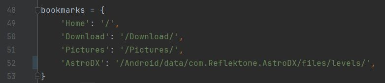

# Project [Launch](https://github.com/rayliu0712/Launch) [Rocket](https://github.com/rayliu0712/Rocket)

"Launch Rocket" is a toolkit (server + client) that can easily transfer files between Android device and PC

## Rocket (Server)

### Requirements

* **Python 3.10 +**
* `PyQt6` `adbutils` Python modules

  ```
  pip install PyQt6 adbutils
  ```

### Customize Bookmarks

You can customize bookmarks by editing `bookmarks` variable in `Rocket.pyw` at line 48 (between `MyAdbDevice` class and `Worker` class)

The Syntax is `'title':'path',`, the path uses `/sdcard` as root. All paths should startswith `/`

If you don't want any bookmark, set bookmarks to empty dictionary (`bookmarks = {}`)

The picture below describes the default bookmarks

